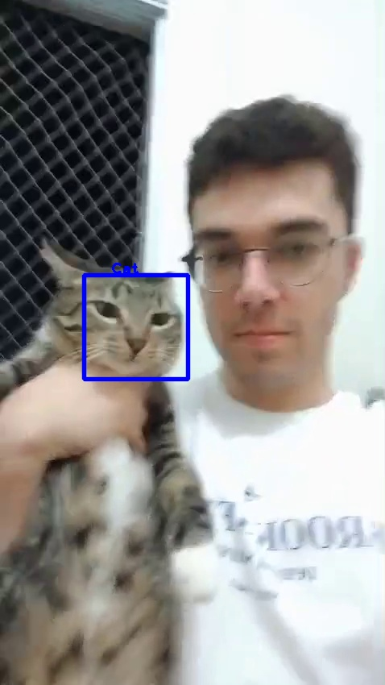
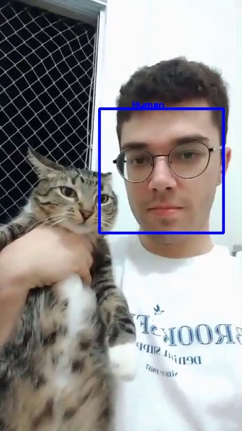

# Self-Sovereign Camera System

[](https://opensource.org/licenses/MIT)
<a href="https://pkg.go.dev/github.com/pedrohba1/SSCS/services"></a>

The Self-Sovereign Camera System (SSCS) is an open-source, distributed camera surveillance solution with integrated facial and human detection capabilities.


This project was part of my Bachelor's thesis in Computer Science at [Universidade Federal de Uberlândia](https://ufu.br/).
I would like to extend my gratitude to all the professors at the institution who provided their support and guidance throughout the development of this project.


 


## Table of Contents
- [Features](#features)
- [Installation](#installation)
- [Usage](#usage)
- [Testing](#testing)
- [Full Feature Walkthrough](#full-feature-walkthrough)
- [Contribution](#contribution)
- [License](#license)
- [Acknowledgments](#acknowledgments)

## Features

1. **Facial Detection**: Capable of detecting faces in real-time, using Haar cascade classifiers.
2. **Movement Detection**: Real-time detection of movement.
3.**Detection event storage**: Recognized patterns on footage can be saved in a database.
4. **Multiple Video Feeds**: If you have multiple cameras you can integrate multiple video feeds.  
5. **Archiving and Playback**: integrate either your local storage our cloud storage to have later access to files.
6. **Self-Sovereign**: Your data, your rules. No third-party control or access, unless you prefer it. In that case, it's up to the user to integrate the tools provided.
7. **Search and Filter**: with the saved data, you can check for when specific events happened in the feed. 

## Future features

1. **Facial Database**: You can save faces for later recognition and notifications.
2. **Notifications**: This software can notify you when some specific events happen on camera, in your phone. 

## Installation

### Prerequisites
- GoLang (v1.19+ recommended)
- OpenCV (v4.0+ recommended)
- ffmpeg (version 4.4.2 recommended)
- Docker (version 24.0.5 recommended) 

To quickly install openCV, just clone this repo and run `make install-opencv`. It will attempt to install all dependencies required and setup openCV properly.

Docker is not necessary for production environment but useful for development and running the scripts in `/services/Makefile`.

Some other libraries might be needed to install run some components:
```
apt install -y libavformat-dev libswscale-dev gcc pkg-config
```

## Testing 

###  Dev environment

Running a development environment can be done via `make dev-env`. This will create a postgres instance and 
a MediaMTX instance running with some video feed to simulate a RTSP connection.

 Running all core functionalities with ` go run ./cmd/daemon/main.go` should run normally after that. 

# Full Feature Walkthrough

This walkthrough will assume that all parts are running in a development environment so the configuration templates can be used
as their default configurations. As the parts of the system are ran under different conditions, i.e. remote servers, alternative
authentication methods, alternative storage structure and so on, the user will have to adjust them on the fly. 

### Setting up working environment

A full working environment setup can be achieved in a few steps. First it is necessary to satisfy all the [prerequisites](#prerequisites). Next,
it is necessary to configure a media server, so SSCS can have somewhere to fetch video from. If there is no media server available for usage yet,
a script to run a [MediaMTX](https://github.com/bluenviron/mediamtx) server is available in `/services/Makefile`. Run it with `make dev-env`. It will also run a PostgreSQL instance, which is necessary for indexing events and storage paths.

For authentication, if necessary, it is possible to use [Keycloak](https://www.keycloak.org/). A script to run it in development is also available in the makefile, and can be run with `make key-cloak`. 

In the given configuration above, this is the following containers expected:

```
$ docker ps --format="table {{.Image}}\t{{.Status}}\t{{.Ports}}\t{{.Names}}"

IMAGE                              NAMES
quay.io/keycloak/keycloak:23.0.7   keycloak
postgres                           sscs-postgres
sscs-mtx                           sscs-mtx
```

To check if the media server is running properly, go to `http://localhost:8889/mystream/` and a video should start playing.

### Connecting SSCS

With all the dev environment, SSCS can be run either through the binary now or by running `go run ./cmd/daemon`. Notice that
it is going to use the `sscs.yml` that is present in the root directory. So make sure to run in the correct path.  It should
start prompting logs as below:

```
INFO[0000] I'm completely operational, and all my circuits are functioning perfectly  package=core
INFO[0000] starting storer service...                    package=storer
WARN[0000] backupPath is not defined in configuration. Files will be erased by default  package=storer
INFO[0000] connecting postgres...                        package=indexer
INFO[0000] recording...                                  package=recorder
[h264 @ 0x7f6760000bc0] no frame!
[h264 @ 0x7f6760000bc0] no frame!
INFO[0000] migrating tables...                           package=indexer
INFO[0000] listening to index events...                  package=indexer
```

It is also possible to install as a Daemon so it keeps running as long as the operating system is running:

```
$ make build
$ sudo ./daemon install
$ sudo ./daemon start
```

When started, SSSC will recognize images, index when they were recognized and what was recognized, record and
handle storage size. It is possible to run multiple recognizers side by side, for the same video feed, just by
running more cores. The recognized images will be saved all into the same folder, as the events will be indexed
into the same database, assuming it is using the same `sscs.yml` configuration for both cores.
<table>
  <tr>
    <td>
      
    </td>
    <td>
      
    </td>
  </tr>
  <tr>
    <td style="text-align: center;">
      <em>Figure 1: Tina, my cat, being recognized from one core</em>
    </td>
    <td style="text-align: center;">
      <em>Figure 2: Me being recognized from another core</em>
    </td>
  </tr>
</table>


### API usage

These are the features of the HTTP API and how to use them:


1. Search for all recognition events, allowing filtering by date range using RFC3339 format dates. The API responds with the recognition context, the creation date of the event, and a hyperlink to the image of what was recognized, with markings.

```
$ curl --request GET \
  --url http://localhost:3000/recognitions \
  --header 'User-Agent: insomnia/8.6.1'

  {
	"data": [
		{
			"Path": "http://localhost:3000/file/thumbs/1713474679488.jpg",
			"Context": "Cat detected",
			"CreatedAt": "2024-04-18T18:11:19.491083-03:00"
		},
		{
			"Path": "http://localhost:3000/file/thumbs/1713474679567.jpg",
			"Context": "Cat detected",
			"CreatedAt": "2024-04-18T18:11:19.571432-03:00"
		},
		{
			"Path": "http://localhost:3000/file/thumbs/1713474679655.jpg",
			"Context": "Cat detected",
			"CreatedAt": "2024-04-18T18:11:19.657414-03:00"
		},
		{
			"Path": "http://localhost:3000/file/thumbs/1713474679737.jpg",
			"Context": "Cat detected",
			"CreatedAt": "2024-04-18T18:11:19.739881-03:00"
		},
		{
			"Path": "http://localhost:3000/file/thumbs/1713474679828.jpg",
			"Context": "Cat detected",
			"CreatedAt": "2024-04-18T18:11:19.830649-03:00"
		}
}
```

2. Search for all recordings, with a date range filter similar to the previous functionality. The API provides the start and end time of each recording as well as a hyperlink for its viewing.

```
$ curl --request GET \
  --url http://localhost:3000/recordings/ \
  --header 'User-Agent: insomnia/8.6.1'

{
	"data": [
		{
			"Path": "http://localhost:3000/file/recordings/feed_2024-04-18_18-11-14.ts",
			"StartTime": "2024-04-18T18:11:24.600196-03:00",
			"EndTime": "2024-04-18T18:11:24.600106-03:00"
		}
	]
}

```

3. Return an aggregate of the recordings over a date range for download.

```
$ curl --request GET \
  --url 'http://localhost:3000/full-recording/?start_date=2024-04-18T18%3A11%3A24.600196-03%3A00&end_date=2024-04-19T18%3A11%3A24.600196-03%3A00' \
  --header 'User-Agent: insomnia/8.6.1'

{
	"data": "http://localhost:3000/file/recordings/2024-04-18T18-11-24-03-00-2024-04-18T18-11-24-03-00.mp4"
}
```


## Contribution
Fork the project.l
Create a new branch (git checkout -b feature/YourFeature).
Commit your changes (git commit -am 'Add some feature').
Push to the branch (git push origin feature/YourFeature).
Open a pull request.
We welcome contributions! Please read our CONTRIBUTING.md for more information on how to contribute to SSCS.


## License
This project is licensed under the MIT License - see the LICENSE.md file for details.


